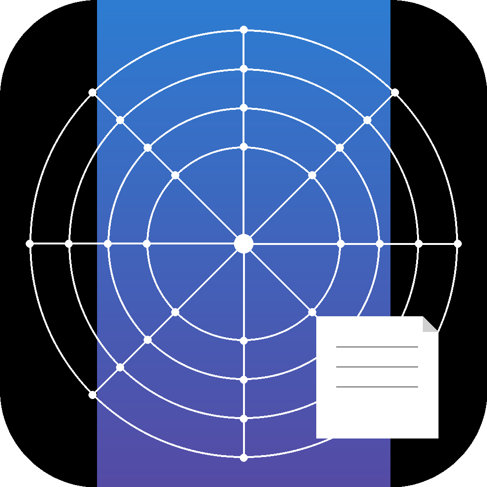

<p align="center">
  
</p>

# ProfileScraper

A powerful desktop application for scraping product data from e-commerce websites with advanced anti-detection capabilities and profile-based configuration.

## Features

- **Profile Management** - Create, edit, and organize scraping profiles with a visual UI
- **Live Job Monitoring** - Real-time progress tracking with granular phase updates (initializing, gathering URLs, crawling products, finalizing)
- **Product-Level Logging** - Detailed logs for each scraped product with diagnostic information
- **Concurrent Scraping** - Configurable worker threads for parallel product scraping
- **Smart Field Extraction** - CSS/XPath selector-based field extraction with attribute support
- **Advanced Pagination** - Support for button-based, infinite scroll, and URL-based pagination
- **Bot Evasion** - Comprehensive anti-detection using patchright with fingerprint randomization
- **Checkpoint System** - Resumable scraping with automatic progress saving
- **Data Export** - Export job data to CSV, JSON, or both formats
- **Job History** - View all past scraping jobs with success/failure counts
- **Database Storage** - SQLite-based storage for profiles, jobs, and scraped data

## Installation

### For Users (macOS)

Download the latest DMG from [releases](https://github.com/ProfileScraper/profile-scraper/releases):
- **Intel Macs**: `ProfileScraper-{version}-x64.dmg`
- **Apple Silicon (M1/M2/M3)**: `ProfileScraper-{version}-arm64.dmg`

**Important**: The app is not notarized with Apple. macOS Gatekeeper will show a warning on first launch.

**Installation Steps:**

1. Download and open the DMG file
2. Drag **ProfileScraper** to your **Applications** folder
3. Try to open ProfileScraper - you'll see a security warning
4. Go to **System Preferences** → **Privacy & Security**
5. Scroll down and click **"Open Anyway"** next to the ProfileScraper message
6. Confirm by clicking **"Open"**

**Optional: Trust Certificate (Recommended)**

To avoid "Open Anyway" for future updates, double-click **"Trust Certificate.command"** in the DMG window:
- Extracts the code signing certificate from ProfileScraper
- Adds it to your system's trusted certificates (requires password)
- Future updates will install without Gatekeeper warnings
- One-time setup per Mac

After the first successful launch (or after trusting the certificate), you can open ProfileScraper normally without any warnings.

### For Developers

```bash
npm install
```

## Development

Start the development server:

```bash
npm run dev
```

Browsers are automatically downloaded to the default playwright cache on first run.

## Building for Distribution

ProfileScraper bundles Chromium browsers (~150MB) during the build process. Separate DMGs are created for Intel and ARM architectures.

### macOS

Build architecture-specific DMGs:

```bash
# ARM (Apple Silicon) - run on ARM Mac
npm run package:mac:arm

# Intel (x64) - run on Intel Mac
npm run package:mac:intel
```

**Output:** `release/ProfileScraper-<version>-<arch>.dmg`

**Note:** You must build on the target architecture. ARM DMGs must be built on ARM Macs, Intel DMGs on Intel Macs. The first build will download browsers (~150MB) which takes 2-3 minutes.

### Windows & Linux

```bash
npm run package:win   # Windows installer
npm run package:linux # Linux AppImage and deb
```

## Usage

### 1. Create a Profile

Navigate to the **Profiles** tab and click **Create New Profile**:

- **Profile Name** - A descriptive name for your scraping target
- **Category URL** - The listing page to start crawling from
- **Product Link Selector** - CSS selector to find product links on the category page
- **Field Selectors** - Map field names to CSS selectors for data extraction
  - Supports text content extraction (default)
  - Supports attribute extraction (e.g., `{selector: "img", attribute: "src"}`)
- **Pagination** - Configure how to navigate through multiple pages
  - Button-based: Click "Next" button
  - Infinite scroll: Auto-scroll to load more
  - URL-based: Increment page number in URL
- **Pre-Actions** - Actions to perform on category page (click, scroll, wait)
- **Product Page Actions** - Actions to perform on each product page

### 2. Start a Scraping Job

1. Go to **Profiles** and click **Run** on your profile
2. The app will:
   - Initialize the browser with anti-detection
   - Gather product URLs from the category page(s)
   - Scrape each product using concurrent workers
   - Save data and logs to the database
3. Monitor progress in the **Jobs** tab
   - See real-time phase updates
   - View product counts and success/failure rates
   - Live data updates every 3 seconds for running jobs

### 3. View & Export Data

1. Click **View Data** on any completed job
2. Browse scraped product data in a searchable table
3. Click **View Logs** on any product to see detailed scraping diagnostics
4. Export data:
   - **Export JSON** - Structured JSON format
   - **Export CSV** - Flat CSV with all fields
   - **Export Both** - Get both formats

## Profile Sharing & Explorer

### Importing Profiles

**From File:**
1. Click "Import Profile" in Profile Library
2. Select "Import File" tab
3. Choose a .json profile file
4. Review and confirm import

**From URL:**
1. Click "Import Profile" in Profile Library
2. Select "Import from URL" tab
3. Paste GitHub raw URL or CDN link (HTTPS only)
4. Review and confirm import

### Exporting Profiles

1. Click "Export" on any profile card
2. Review the warning about sharing
3. Choose save location
4. Profile downloads as JSON file

### Profile Explorer

Browse community-contributed public profiles:
1. Navigate to "Profile Explorer" tab
2. Search by name, domain, or author
3. Filter by tags (e-commerce, real-estate, etc.)
4. Click "Clone" to create an editable copy

Public profiles are read-only. Clone them to make modifications.

### Domain Grouping

Organize your profiles by website:
1. Click "Grouped by Domain" toggle in Profile Library
2. Profiles grouped under domain headers
3. Click domain to collapse/expand
4. View preference persists across sessions

## Data Storage

All data is stored in `~/Library/Application Support/ProfileScraper/`:

```
ProfileScraper/
├── data/
│   └── scraper.db          # SQLite database
├── logs/
│   └── scrape.log          # Application logs
└── output/
    └── {profileId}/
        └── {jobId}/
            └── progress.json  # Checkpoint data
```

## Project Structure

```
src/
├── main/
│   ├── database/         # SQLite repositories (profiles, jobs, products, logs)
│   ├── scraper/          # Scraping engine (orchestrator, workers, crawlers)
│   ├── ipc/              # IPC handlers for renderer communication
│   ├── storage/          # Data export utilities
│   └── main.ts           # Electron main process entry
├── renderer/
│   ├── components/       # React UI components
│   ├── store/            # Zustand state management
│   ├── hooks/            # React hooks
│   └── App.tsx           # React app entry
└── shared/
    ├── types.ts          # Shared TypeScript types
    └── ipc-channels.ts   # IPC channel definitions
```

## Tech Stack

- **Electron** - Desktop app framework
- **React** - UI framework
- **TypeScript** - Type safety
- **Patchright** - Anti-detection browser automation (Playwright fork)
- **SQLite** - Embedded database (node:sqlite)
- **Tailwind CSS v4** - Styling
- **Vite** - Build tool
- **Zustand** - State management

## Bot Evasion Features

ProfileScraper includes comprehensive anti-detection measures:

- Randomized user agents across Chrome versions
- Varied viewport sizes per worker
- Hardware specs randomization (CPU cores, memory, battery)
- WebGL vendor spoofing
- Navigator properties masking
- Human-like behavior simulation:
  - Mouse movements
  - Random delays between actions
  - Variable timing patterns

## License

MIT
